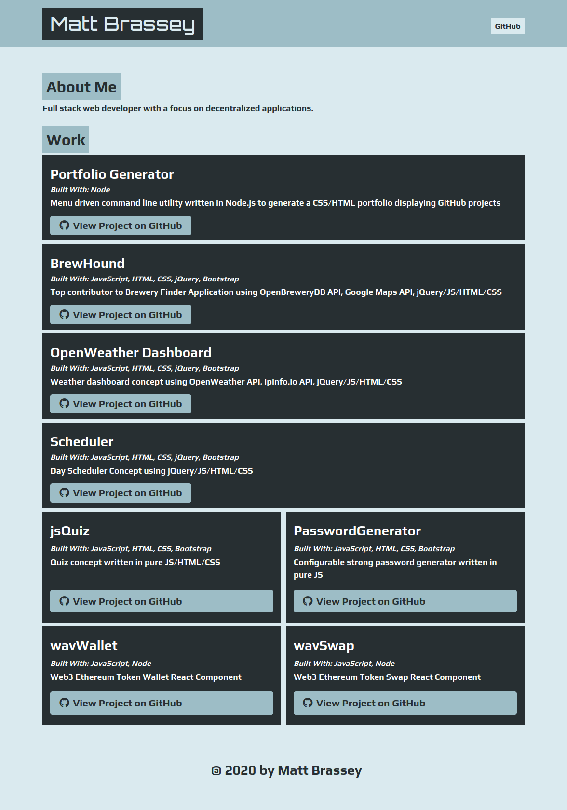

# Portfolio Generator

> Menu driven command line utility written in Node.js to generate a CSS/HTML portfolio displaying GitHub projects.

- [x] [Capture user input](https://github.com/MBrassey/PortfolioGenerator/issues/1)
- [x] [Generate the HTML file](https://github.com/MBrassey/PortfolioGenerator/issues/2)
- [x] [Prompt user for more input](https://github.com/MBrassey/PortfolioGenerator/issues/3)
- [x] [Modify the HTML template to handle more data](https://github.com/MBrassey/PortfolioGenerator/issues/4)
- [x] [Generate entire website](https://github.com/MBrassey/PortfolioGenerator/issues/5)
- [x] [Finishing Touches](https://github.com/MBrassey/PortfolioGenerator/issues/6)
<h6>
[ Click the below images to view the <a href="https://MBrassey.github.io/PortfolioGenerator/">webapplication</a> ]
</h6>

[
](https://MBrassey.github.io/PortfolioGenerator/)

[
](https://MBrassey.github.io/PortfolioGenerator/)